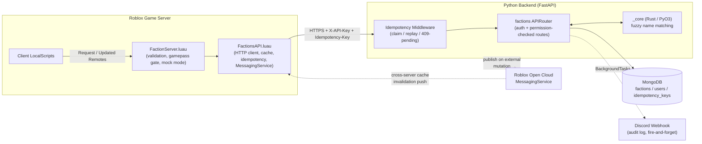

A modular, server-authoritative faction system for a Roblox game: a Python/Rust
backend exposing a versioned REST API, and a Luau client that Roblox game
servers use to talk to it. Built as a commissioned, two-person project —
backend and platform integration by **Ken**, with Roblox-side systems and UI
by **[Jason Davila](https://celuxis.com)**.

Factions in this system aren't just a group tag: single-membership
enforcement, gamepass-gated creation, progression-based ranks with granular
permissions, a real-money-adjacent treasury, prestige-gated leveling, and a
lifetime leaderboard — all enforced server-side, because a client-authoritative
version of any of this is a dupe exploit waiting to happen.

---

## Why this exists

Roblox games routinely ship faction/guild systems as client-trusted state —
a `RemoteEvent` sets a value, a script on the other end believes it. That
model breaks the moment a player wants to duplicate treasury funds, grant
themselves a rank they can't hold, or rejoin a faction they were kicked from.
This project moves *all* of that authority off the Roblox client and into a
backend that Roblox game servers call over HTTPS, with every mutation
re-validated against the database on every request. Roblox becomes a
rendering and input layer; the backend is where the rules actually live.

## Architecture



The Roblox side is split in two deliberately: `FactionServer.luau` owns everything
player-facing (input validation, profanity filtering, gamepass/group gating, a
`MOCK_MODE` in-memory backend for offline Studio testing) and never touches the
network itself; `FactionsAPI.luau` owns everything backend-facing (HTTP, caching,
retries, idempotency keys, the MessagingService subscription) and knows nothing
about Roblox UI concerns. Swapping `MOCK_MODE` off is the only thing that changes
which one actually talks to the backend — the client-facing `Request`/`Updated`
Remote contract is identical either way.

The backend is distributed as an installable Python package (`backend`) that
mounts into a host FastAPI app — it doesn't own the ASGI app itself, so it can
be embedded alongside other services (a Discord bot's API, an admin panel,
etc.) without becoming a second source of truth.

## Tech stack

| Layer | Choice | Why |
|---|---|---|
| API framework | FastAPI (`APIRouter`) | Async-native, Pydantic-integrated validation, mountable into a host app |
| Database | MongoDB via **PyMongo Async** | Document model fits nested faction/rank/permission data; async driver, not Motor |
| Validation / models | Pydantic v2 | Aliasing to Mongo's `_id`, structural validation on every request body |
| CPU-bound logic | Rust via PyO3 (`backend._core`) | Fuzzy faction/rank name matching (Levenshtein) scanned across every existing name — cheap in Rust, wasteful per-call over FFI otherwise |
| Build | `uv` + `maturin` (abi3-py39) | Single Python-version-independent wheel for the Rust extension |
| Roblox link | Roblox Open Cloud (MessagingService) + a hand-written HTTP/Luau client | Bidirectional sync without polling |
| Idempotency | Starlette `BaseHTTPMiddleware`, atomic claim → execute → store | Mounted once at the app level (same "can't forget it" precedent as the API-key dependency) instead of repeated per route |
| Audit logging | Discord webhooks, fire-and-forget via `BackgroundTasks` | Never on the request's critical path — a Discord outage can't fail a faction mutation |

## Engineering decisions worth calling out

**Every mutating endpoint follows the same authorization chain, no exceptions:**
resolve the faction (404 if missing) → resolve the caller's membership *in that
faction* (403 if not a member) → check the specific permission flag the action
requires (not "is owner", except where disbandment/ownership genuinely is
owner-only) → only then write. Rank self-escalation is blocked explicitly: a
`manage_ranks` holder can't assign or edit a rank at or above their own level.

```python
faction = await _get_faction_or_404(factions_db, faction_id)
initiator_rank = await require_faction_permission(
    users_db, faction, kick_data.initiator_id, "manage_members"
)
if target_rank and target_rank.level >= initiator_rank.level:
    raise HTTPException(403, "Cannot kick a member with an equal or higher rank.")
```

**Concurrency is handled at the data layer, not in application logic.**
Treasury withdrawals guard the balance check in the *same* atomic
`update_one` as the decrement (`$gte` filter + `$inc`), never a separate
read-then-write — which would be a race under concurrent requests. Faction
name uniqueness and join-code uniqueness are backed by real MongoDB unique
indexes; the fuzzy-similarity pre-check is a friendly error message, not the
actual guarantee.

```python
result = await factions_db.update_one(
    {"_id": faction_id, "treasury.gold": {"$gte": amount}},
    {"$inc": {"treasury.gold": -amount}},
)
if result.matched_count == 0:
    raise HTTPException(400, "Insufficient treasury funds for this withdrawal.")
```

**The Rust boundary is drawn deliberately narrow.** I/O — database calls,
webhook sends, Roblox Open Cloud requests — stays in async Python, since Rust
doesn't help I/O-bound work and just adds a maintenance surface. The only
`_core` functions are the CPU-bound scan over every existing faction/rank name
on a rename or creation, batched into a single FFI call instead of one
`is_similar()` round-trip per candidate.

**Renown drives level, title, and member capacity — and none of those three are
stored.** Renown itself is award-only (`$inc`-only, rejects non-positive amounts,
no endpoint ever sets it directly), and level/title/capacity are derived fresh
from it on every read by walking a fixed ladder — the same pattern the
existing manual prestige/title system already used, just never persisted this
time, so there's nothing for the two to drift out of sync on. A faction's
custom-rank system stays fully independent of this: renown gates *how many*
members a faction can hold, not what ranks it can have.

**Idempotency is a claim, not just a cache.** Every mutating request requires
an `Idempotency-Key` header; the middleware's first move is an atomic
`insert_one` guarded by a unique index on the key, so a client's own retry
landing *while the first attempt is still in flight* gets a `409` instead of
re-running the handler — replaying a stored response only covers the case
where the first attempt already finished. Without the claim step, idempotency
would only protect against retries-after-failure, not retries-after-slow,
which is the case that actually matters for something like `AwardRenown`.

**Join-code visibility is enforced by what the response model contains, not
by a per-route viewer check.** `code` is excluded from every faction-returning
route's response model by default (`response_model_exclude={"code"}`); only
`create` and `refresh-code` — where the caller is the owner by construction —
and the complete-state endpoint (which already knows who's asking) ever
include it. No route has to remember to check "is this caller the owner" just
to decide whether to redact a field.

**The Luau client mirrors the API's shape, not just its endpoints.** Every
function in `FactionsAPI.luau` matches a route's exact payload and error
semantics (404/403/409/400 surfaced as a typed `ApiError.code`, not a raw
status number), plus:

- TTL-based response caching with in-flight request coalescing, so N
  simultaneous callers on the same server collapse into one HTTP call instead
  of N.
- A `MessagingService` subscription so the backend can push cache invalidation
  to every live Roblox server the moment a faction changes through a path
  that didn't originate from Roblox (e.g. a Discord bot command) — otherwise
  a server would keep serving a stale faction until its TTL expired.
- The API key loaded via `HttpService:GetSecret`, never a literal in source.

```lua
local ok, faction = FactionsAPI.GetFactionById(factionId) -- cached, coalesced
if not ok then
    if faction.code == "not_found" then
        -- handle a faction that no longer exists
    end
    return
end

local ok2, updated = FactionsAPI.KickMember(factionId, initiatorId, targetId)
```

## API surface

All routes sit behind a shared-secret `X-API-Key` header (or Roblox Open Cloud
signature verification), independent of the per-faction permission checks
below. Every mutating route additionally requires an `Idempotency-Key` header.
`code` (the join code) is excluded from every response except where marked —
see "Join-code visibility is enforced by what the response model contains"
above.

| Method | Route | Auth beyond API key | Notes |
|---|---|---|---|
| `GET` | `/factions/{id}` | — | public read |
| `GET` | `/factions/name/{name}` | — | case-insensitive |
| `GET` | `/factions/{id}/members` | — | resolves rank from `custom_ranks`, never a stored snapshot |
| `GET` | `/factions/player/{roblox_id}` | — | reverse lookup: a player's current faction |
| `GET` | `/factions/player/{roblox_id}/state` | — | faction + this player's membership + members + ranks in one call; includes `code` only if this player is the owner |
| `GET` | `/factions/leaderboard` | — | sorted by renown, paginated (`limit`/`skip`) |
| `POST` | `/factions/create` | — | atomic gamepass-or-credit check, unwinds fully on any downstream failure; **includes `code`** |
| `PATCH` | `/factions/{id}/update` | `manage_faction` | |
| `DELETE` | `/factions/{id}` | owner-only | disbands, clears every member's membership |
| `POST` | `/factions/{id}/join` | join-code match | atomic capacity guard (renown-derived), unwinds on a lost race |
| `POST` | `/factions/{id}/leave` | — | owner leaving disbands the faction |
| `POST` | `/factions/{id}/kick` | `manage_members` | can't kick an equal-or-higher rank |
| `POST` | `/factions/{id}/refresh-code` | `manage_faction` | **includes `code`**; old code invalid immediately |
| `PATCH` | `/factions/{id}/members/{id}/rank` | `manage_ranks` | self-escalation blocked |
| `PATCH` | `/factions/{id}/upgrade` | `manage_faction` | prestige-gated, 12 named tiers (Initiate → The Nexus) — manual, independent of renown |
| `POST` | `/factions/{id}/renown` | server-only | `$inc`-only, no permission check — the one documented exception to the auth chain |
| `POST` | `/factions/{id}/treasury/deposit` \| `withdraw` | `manage_treasury` | atomic balance guard |
| `POST`/`PATCH`/`DELETE` | `/factions/{id}/ranks[/{id}]` | `manage_ranks` | id-keyed, capped per faction, hierarchy-checked |

## Project structure

```
HREFactionSystem/
├── backend/                      # Python package + Rust extension
│   ├── src/backend/
│   │   ├── routers/factions.py   # the APIRouter — all HTTP-facing logic
│   │   ├── models/factions.py    # Pydantic v2 request/response models
│   │   ├── security.py           # auth dependency + permission resolver
│   │   ├── db.py, config.py, utils.py, types.py
│   │   └── _core (compiled)      # from src/lib.rs via maturin
│   ├── src/lib.rs                # Rust: fuzzy name matching
│   ├── Cargo.toml
│   └── pyproject.toml
└── ServerScriptService/
    ├── FactionsAPI.luau          # backend client: HTTP, cache, idempotency, MessagingService
    └── FactionServer.luau        # player-facing Remotes: validation, gamepass gate, mock mode
```

## Running it locally

```bash
# Backend
cd backend
uv sync
uv run maturin develop          # builds the Rust extension into the venv
cp .env.example .env            # HREF_MONGO_URI, HREF_API_SHARED_SECRET, HREF_DISCORD_WEBHOOK_URL
uv run uvicorn your_host_app:app --reload
```

```python
# Host app: mount the router and opt into idempotency + startup indexes
from backend.routers.factions import router as factions_router
from backend.idempotency import IdempotencyMiddleware
from backend.db import ensure_indexes

app.include_router(factions_router)
app.add_middleware(IdempotencyMiddleware)

@app.on_event("startup")
async def _startup():
    await ensure_indexes()
```

```lua
-- Roblox: paste both ServerScriptService/FactionsAPI.luau and FactionServer.luau,
-- then before first use:
local FactionsAPI = require(game.ServerScriptService.FactionsAPI)
FactionsAPI.Config.BaseUrl = "https://your-deployed-backend.example.com"
FactionsAPI.Config.ApiKeySecretName = "HREF_API_SHARED_SECRET" -- a Studio/published secret, matching the backend's key

-- FactionServer.luau's own CONFIG.MOCK_MODE defaults to true (an in-memory
-- fake backend for offline Studio testing, no network calls at all) - flip
-- it to false once the backend above is actually reachable.
```

## Scope

**In scope:** single-faction membership, gamepass/credit-gated creation,
refreshable join codes, predefined + custom progression ranks with granular
permissions, permanent renown → finite named levels, lifetime leaderboard,
owner-only faction management, custom cosmetic slots (banners, logos,
armors), and exploit-resistant server-authoritative enforcement on every
mutating endpoint.

**Out of scope (separate engagements):** Roblox datastore cleanup tooling,
admin/moderation dashboards, ongoing hosting.

## Credits

- **Ken** — backend architecture, API design, Rust extension, Roblox-side integrations/systems
- **[Jason Davila](https://celuxis.com)** — Roblox-side systems, UI, and
  in-game integration.

This repository is shared as a portfolio reference for a commercial,
commissioned project; production configuration, secrets, and the host game's
codebase are intentionally excluded.
